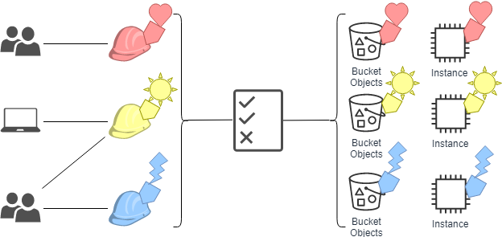
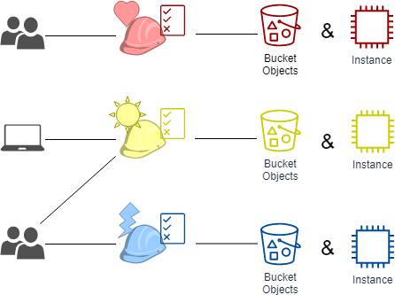

# Attribute-based access control (ABAC)

### What is ABAC for AWS?
Attribute-based access control (ABAC) is an authorization strategy that defines permissions based on attributes. In AWS, these attributes are called tags. You can attach tags to IAM resources, including IAM entities (users or roles) and to AWS resources. You can create a single ABAC policy or small set of policies for your IAM principals. These ABAC policies can be designed to allow operations when the principal's tag matches the resource tag. ABAC is helpful in environments that are growing rapidly and helps with situations where policy management becomes cumbersome.

For example, you can create three roles with the access-project tag key. Set the tag value of the first role to Heart, the second to Sun, and the third to Lightning. You can then use a single policy that allows access when the role and the resource are tagged with the same value for access-project.

### Comparing ABAC to the traditional RBAC model

The traditional authorization model used in IAM is called role-based access control (RBAC). RBAC defines permissions based on a person's job function, known outside of AWS as a role. Within AWS a role usually refers to an IAM role, which is an identity in IAM that you can assume. IAM does include managed policies for job functions that align permissions to a job function in an RBAC model.

In IAM, you implement RBAC by creating different policies for different job functions. You then attach the policies to identities (IAM users, groups of users, or IAM roles). As a best practice, you grant the minimum permissions necessary for the job function. This is known as granting least privilege. Do this by listing the specific resources that the job function can access. The disadvantage to using the traditional RBAC model is that when employees add new resources, you must update policies to allow access to those resources.

For example, assume that you have three projects, named Heart, Sun, and Lightning, on which your employees work. You create an IAM role for each project. You then attach policies to each IAM role to define the resources that anyone allowed to assume the role can access. If an employee changes jobs within your company, you assign them to a different IAM role. People or programs can be assigned to more than one role. However, the Sun project might require additional resources, such as a new Amazon S3 bucket. In that case, you must update the policy attached to the Sun role to specify the new bucket resource. Otherwise, Sun project members are not allowed to access the new bucket.

### ABAC provides the following advantages over the traditional RBAC model:

**ABAC permissions scale with innovation**. It's no longer necessary for an administrator to update existing policies to allow access to new resources. For example, assume that you designed your ABAC strategy with the access-project tag. A developer uses the role with the access-project = Heart tag. When people on the Heart project need additional Amazon EC2 resources, the developer can create new Amazon EC2 instances with the access-project = Heart tag. Then anyone on the Heart project can start and stop those instances because their tag values match.

**ABAC requires fewer policies**. Because you don't have to create different policies for different job functions, you create fewer policies. Those policies are easier to manage.

**Using ABAC, teams can change and grow quickly**. This is because permissions for new resources are automatically granted based on attributes. For example, if your company already supports the Heart and Sun projects using ABAC, it's easy to add a new Lightning project. An IAM administrator creates a new role with the access-project = Lightning tag. It's not necessary to change the policy to support a new project. Anyone that has permissions to assume the role can create and view instances tagged with access-project = Lightning. Additionally, a team member might move from the Heart project to the Lightning project. The IAM administrator assigns the user to a different IAM role. It's not necessary to change the permissions policies.

**Granular permissions are possible using ABAC**. When you create policies, it's a best practice to grant least privilege. Using traditional RBAC, you must write a policy that allows access to only specific resources. However, when you use ABAC, you can allow actions on all resources, but only if the resource tag matches the principal's tag.

**Use employee attributes from your corporate directory with ABAC**. You can configure your SAML-based or web identity provider to pass session tags to AWS. When your employees federate into AWS, their attributes are applied to their resulting principal in AWS. You can then use ABAC to allow or deny permissions based on those attributes.