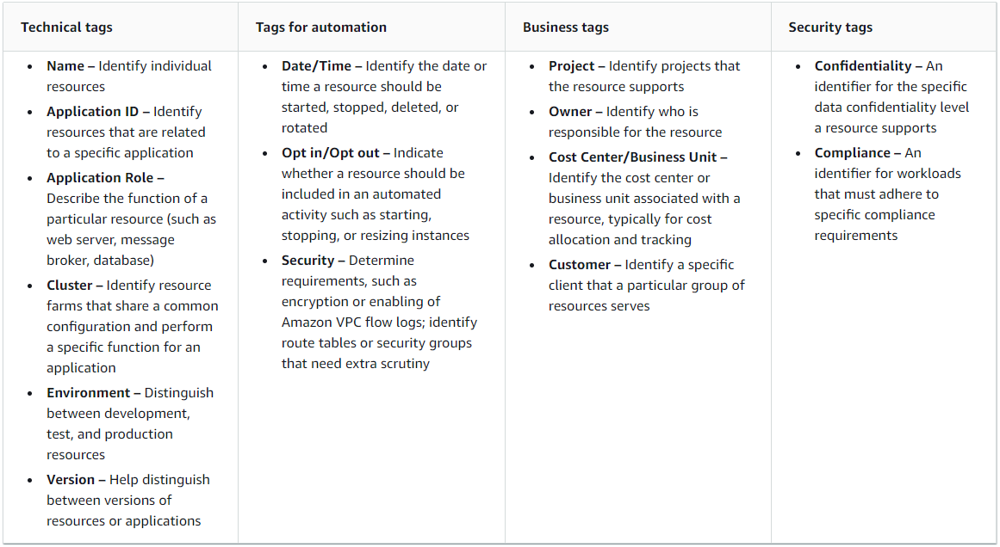
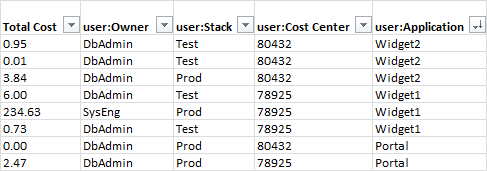

# Tagging AWS resources
You can assign metadata to your AWS resources in the form of tags. Each tag is a label consisting of a user-defined key and value. Tags can help you manage, identify, organize, search for, and filter resources. You can create tags to categorize resources by purpose, owner, environment, or other criteria.

Each tag has two parts:

A *tag key* (for example, CostCenter, Environment, or Project). Tag keys are case sensitive.

A *tag value* (for example, 111122223333 or Production). Like tag keys, tag values are case sensitive.

You can use tags to categorize resources by purpose, owner, environment, or other criteria.

AWS supports tagging on all core infrastructure resources that incur charges. Most other AWS resources also support tagging. 

### Best practices
As you create a tagging strategy for AWS resources, follow best practices:

* Do not store personally identifiable information (PII) or other confidential or sensitive information in tags.

* Use a standardized, case-sensitive format for tags, and apply it consistently across all resource types.

* Consider tag guidelines that support multiple purposes, like managing resource access control, cost tracking, automation, and organization.

* Use automated tools to help manage resource tags. AWS Resource Groups and the Resource Groups Tagging API enable programmatic control of tags, making it easier to automatically manage, search, and filter tags and resources.

* Use too many tags rather than too few tags.

* Remember that it is easy to change tags to accommodate changing business requirements, but consider the consequences of future changes. For example, changing access control tags means you must also update the policies that reference those tags and control access to your resources.

* You can automatically enforce the tagging standards that your organization chooses to adopt by creating and deploying tag policies using AWS Organizations. Tag policies let you specify tagging rules that define valid key names and the values that are valid for each key. You can choose to only monitor, giving you an opportunity to evaluate and clean up your existing tags. Once your tags are in compliance with your chosen standards, you can then turn on enforcement in the tag policies to prevent non-compliant tags from being created.

### Tagging categories
Companies that are most effective in their use of tags typically create business-relevant tag groupings to organize their resources along technical, business, and security dimensions. Companies that use automated processes to manage their infrastructure also include additional, automation-specific tags.

### Tag naming limits and requirements
The following basic naming and usage requirements apply to tags:

* Each resource can have a maximum of 50 user created tags.

* System created tags that begin with aws: are reserved for AWS use, and do not count against this limit. You can't edit or delete a tag that begins with the aws: prefix.

* For each resource, each tag key must be unique, and each tag key can have only one value.

* The tag key must be a minimum of 1 and a maximum of 128 Unicode characters in UTF-8.

* The tag value must be a minimum of 0 and a maximum of 256 Unicode characters in UTF-8.

* Allowed characters can vary by AWS service. For information about what characters you can use to tag resources in a particular AWS service, see its documentation. In general, the allowed characters are letters, numbers, spaces representable in UTF-8, and the following characters: _ . : / = + - @.

* Tag keys and values are case sensitive. As a best practice, decide on a strategy for capitalizing tags, and consistently implement that strategy across all resource types. For example, decide whether to use Costcenter, costcenter, or CostCenter, and use the same convention for all tags. Avoid using similar tags with inconsistent case treatment.

### Common tagging strategies

**Tags for resource organization**
Tags are a good way to organize AWS resources in the AWS Management Console. You can configure tags to be displayed with resources, and can search and filter by tag. With the AWS Resource Groups service, you can create groups of AWS resources based on one or more tags or portions of tags. You can also create groups based on their occurrence in an AWS CloudFormation stack. Using Resource Groups and Tag Editor, you can consolidate and view data for applications that consist of multiple services, resources, and Regions in one place.

**Tags for cost allocation**
AWS Cost Explorer and detailed billing reports let you break down AWS costs by tag. Typically, you use business tags such as cost center/business unit, customer, or project to associate AWS costs with traditional cost-allocation dimensions. But a cost allocation report can include any tag. This lets you associate costs with technical or security dimensions, such as specific applications, environments, or compliance programs. The following is an example of a partial cost allocation report.

**Tags for automation**
Resource or service-specific tags are often used to filter resources during automation activities. Automation tags are used to opt in or opt out of automated tasks or to identify specific versions of resources to archive, update, or delete. For example, you can run automated start or stop scripts that turn off development environments during nonbusiness hours to reduce costs. In this scenario, Amazon Elastic Compute Cloud (Amazon EC2) instance tags are a simple way to identify instances to opt out of this action. For scripts that find and delete stale, out-of-date, or rolling Amazon EBS snapshots, snapshot tags can add an extra dimension of search criteria.

**Tags for access control**
IAM policies support tag-based conditions, letting you constrain IAM permissions based on specific tags or tag values. For example, IAM user or role permissions can include conditions to limit EC2 API calls to specific environments (such as development, test, or production) based on their tags. The same strategy can be used to limit API calls to specific Amazon Virtual Private Cloud (Amazon VPC) networks. Support for tag-based, resource-level IAM permissions is service specific. When you use tag-based conditions for access control, be sure to define and restrict who can modify the tags.

### Tagging governance
An effective tagging strategy uses standardized tags and applies them consistently and programmatically across AWS resources. You can use both reactive and proactive approaches for governing tags in your AWS environment.

**Reactive governance** is for finding resources that are not properly tagged using tools such as the Resource Groups Tagging API, AWS Config Rules, and custom scripts. To find resources manually, you can use Tag Editor and detailed billing reports.

**Proactive governance** uses tools such as AWS CloudFormation, AWS Service Catalog, tag policies in AWS Organizations, or IAM resource-level permissions to ensure standardized tags are consistently applied at resource creation.

For example, you can use the AWS CloudFormation Resource Tags property to apply tags to resource types. In AWS Service Catalog, you can add portfolio and product tags that are combined and applied to a product automatically when it is launched. More rigorous forms of proactive governance include automated tasks. For example, you can use the Resource Groups Tagging API to search an AWS environment’s tags, or run scripts to quarantine or delete improperly tagged resources.
