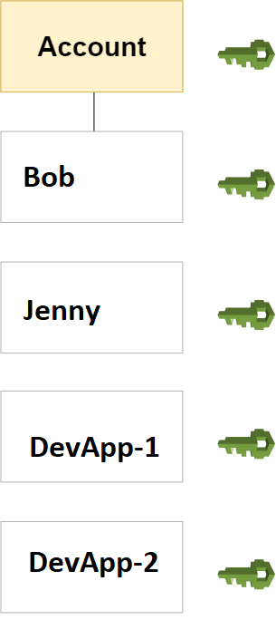

# AWS identity management: Users
For greater security and organization, you can give access to your AWS account to specific users—identities that you create with custom permissions. You can further simplify access for those users by federating existing identities into AWS.

### Topics

* First-time access only: Your root user credentials
* IAM users
* Federating existing users

#### First-time access only: Your root user credentials

When you create an AWS account, you create an AWS account root user identity, which you use to sign in to AWS. You can sign in to the AWS Management Console using this root user identity—that is, the email address and password that you provided when creating the account. This combination of your email address and password is also called your root user credentials.

#### IAM users
Instead of sharing your root user credentials with others, you can create individual IAM users within your account that correspond to users in your organization. IAM users are not separate accounts; they are users within your account. Each user can have its own password for access to the AWS Management Console. You can also create an individual access key for each user so that the user can make programmatic requests to work with resources in your account.

In the following figure, the users Bob, Jenny, DevApp1, DevApp2, have been added to a single AWS account. Each user has its own credentials.

Notice that some of the users are actually applications (for example, DevApp1). An IAM user doesn't have to represent an actual person; **you can create an IAM user in order to generate an access key for an application that runs in your corporate network and needs AWS access**.