# Office365 Setup

1. Sing up for [Office 365 E3 free 1-month trial](https://signup.microsoft.com/get-started/signup?products=cfq7ttc0k59j:0009&culture=en-us&country=lk&ali=1).

1. In the Email box enter admin@yourdomain.xyz (domain you setup earlier).

    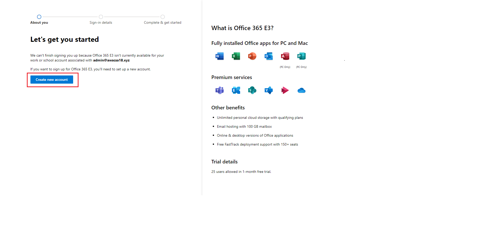

1. on the next screen click on **Create new account**

    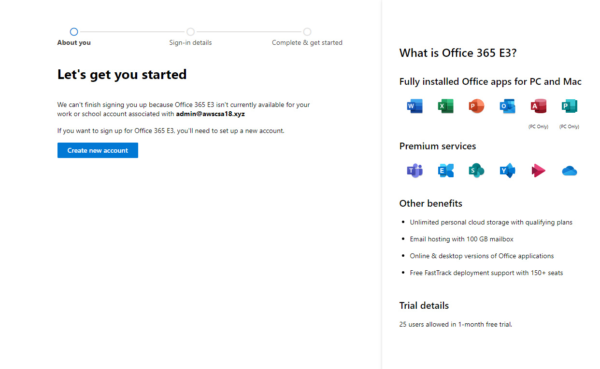

1. Fill the information on this screen.Click **Next**

   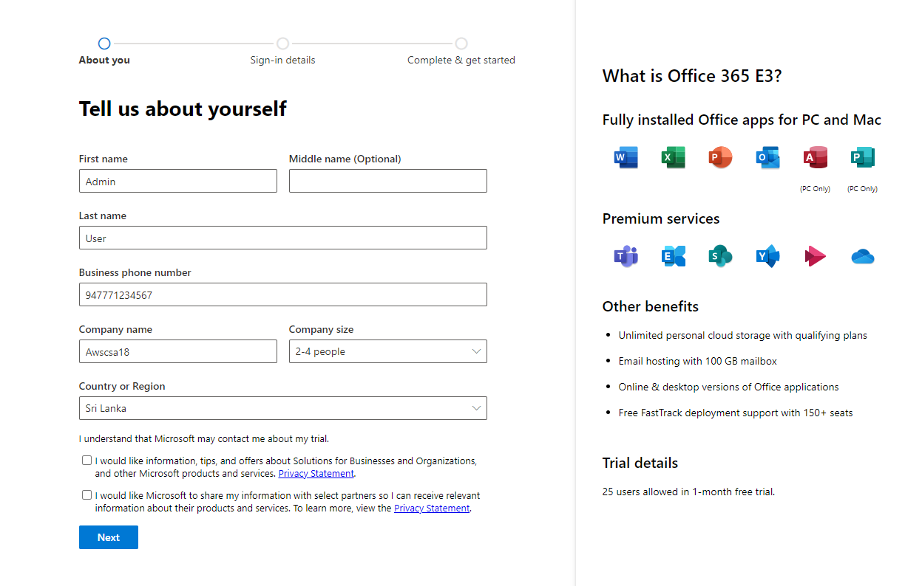

1. Verify the phone number you entered on the previous screen.

    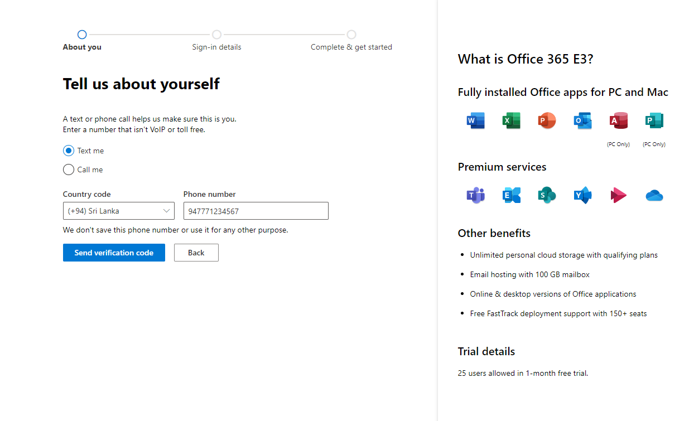

    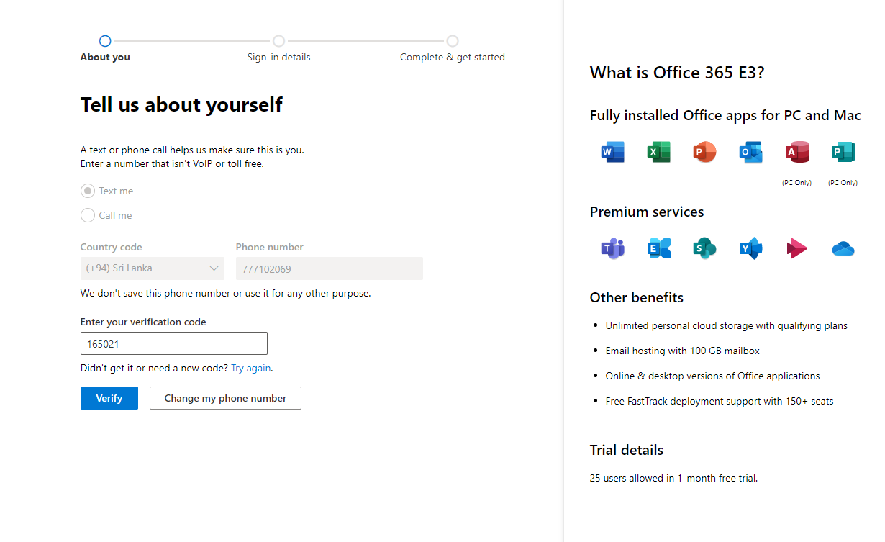

1. On this screen, setup your Office365 default admin account.

    Username=admin

    Domain name=first part of your domain(for ex. awscsa18 for awscsa18.xyz)

    Password:

    Click **Next**

1. It will take sometime to create the account.Do not refresh the page until you see below screen. 

    Note down your **username**.

    Click on **Get Started**.

    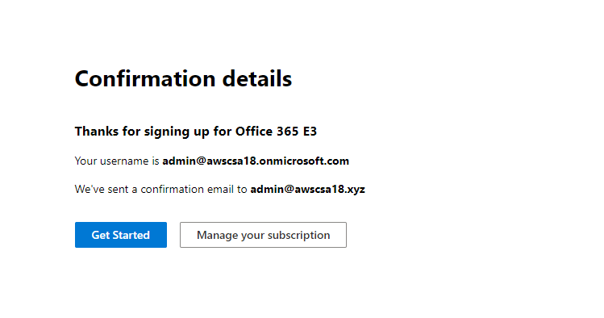

1. On the next login screen, enter the previous user name and the password to login to Office365 Admin Portal.

    It will take you to a setup wizard.

1. Click **Continue** on the bottom of the page.

    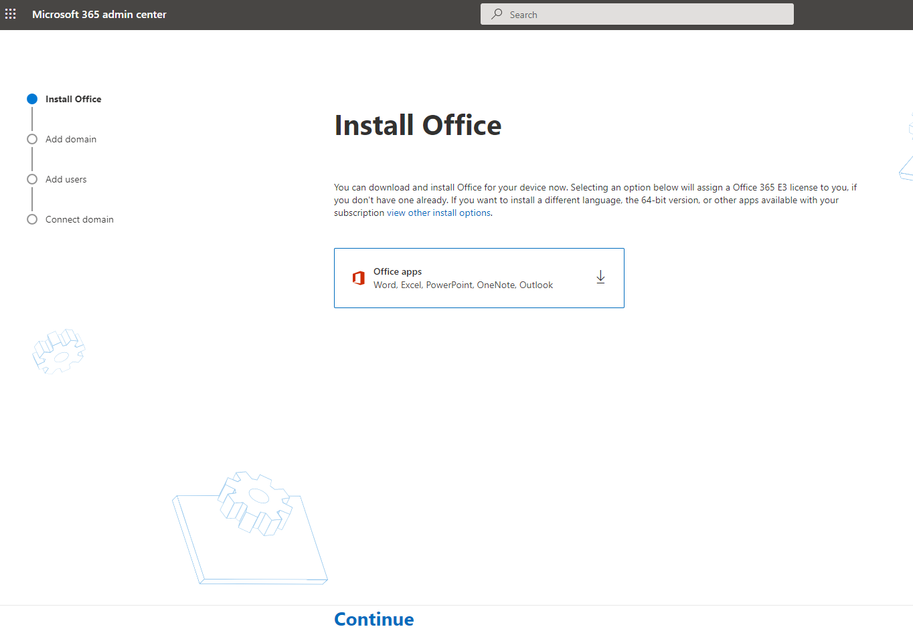 

1. Enter your domain name while the first option (Yes, add this domain now) selected. Then click **Use this domain** on the bottom of the page.

    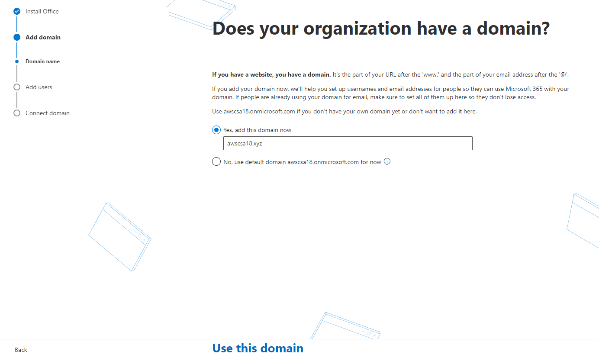

1. On this screen click on **More option**.

    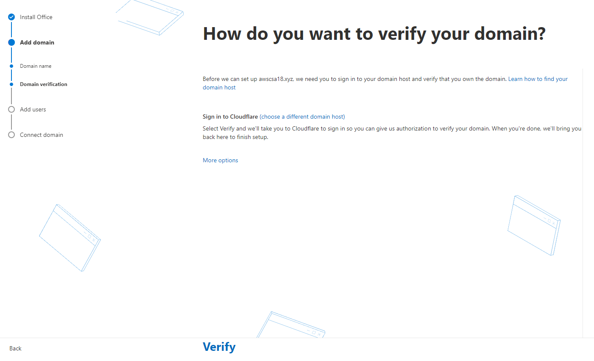

    Select the second option, **Add a TXT record to the domain's DNS records**

    Click **Continue**

    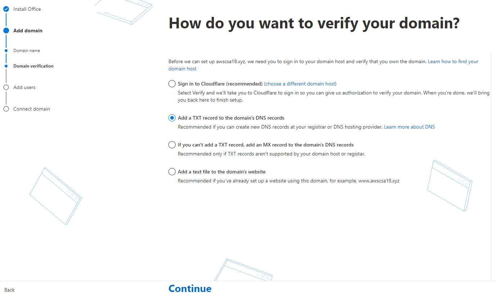

1. Note the TXT record information metioned on the page.

    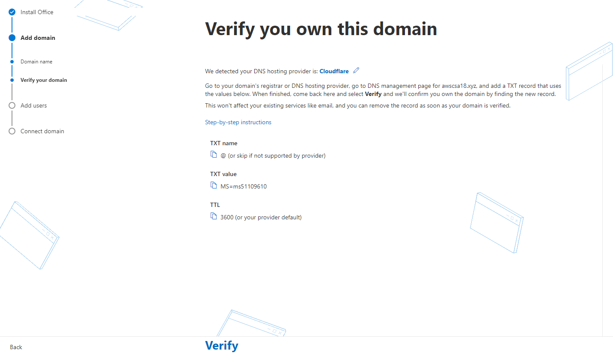

1. Login to your DNS hosting provider account.[Cloudflare](https://dash.cloudflare.com/login/).

