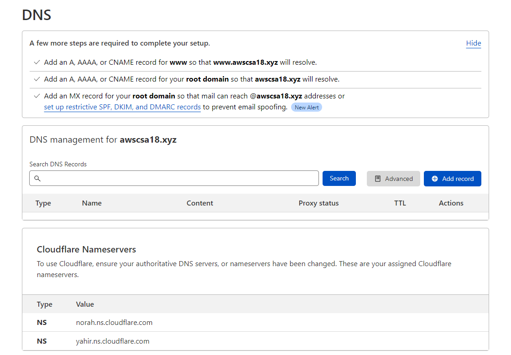
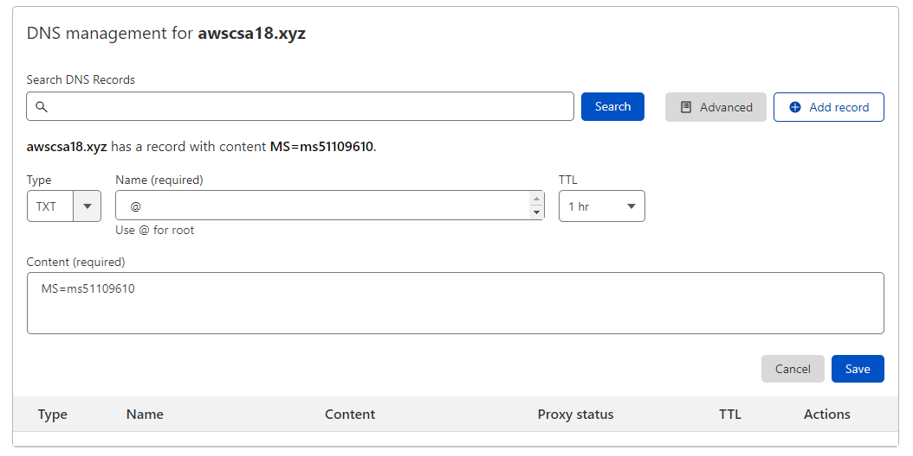
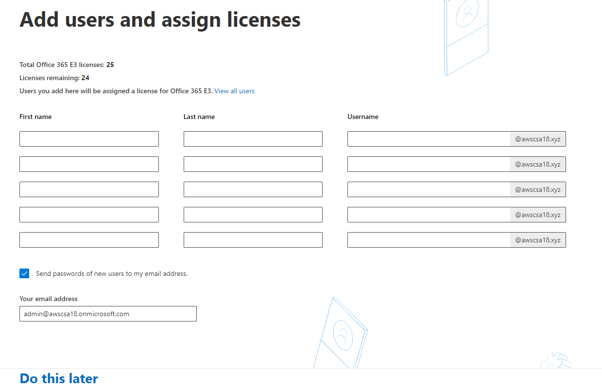
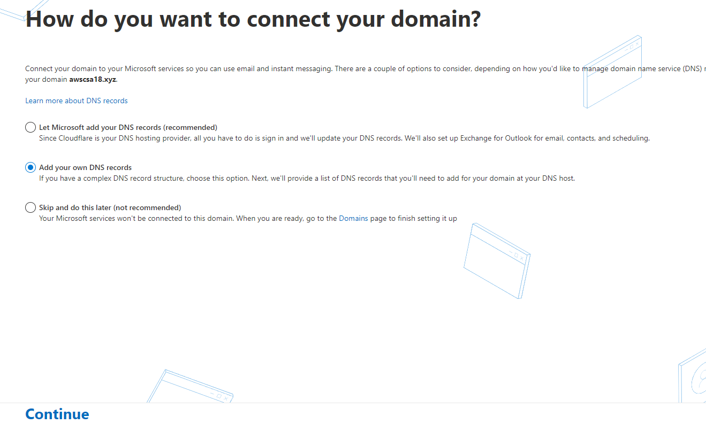
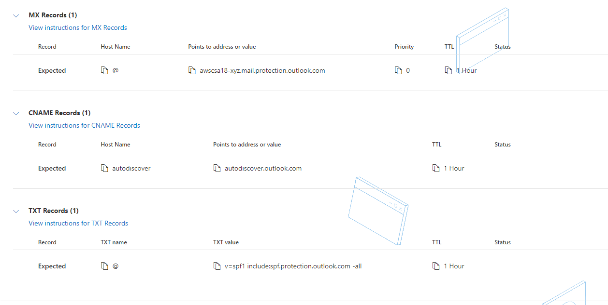
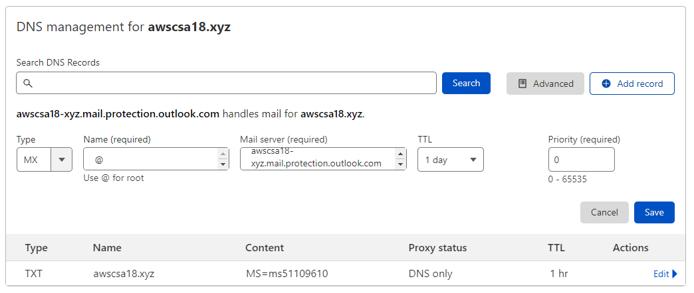
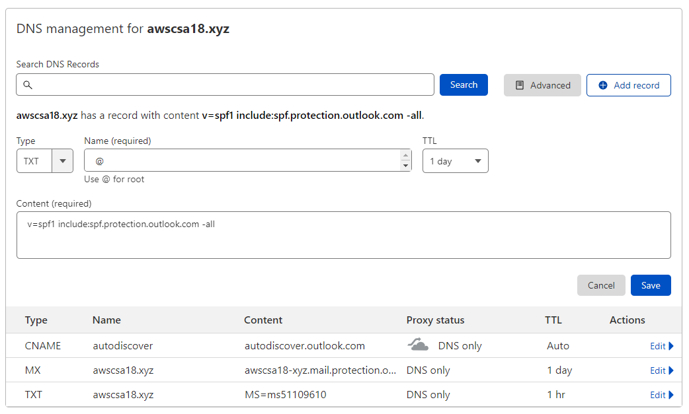
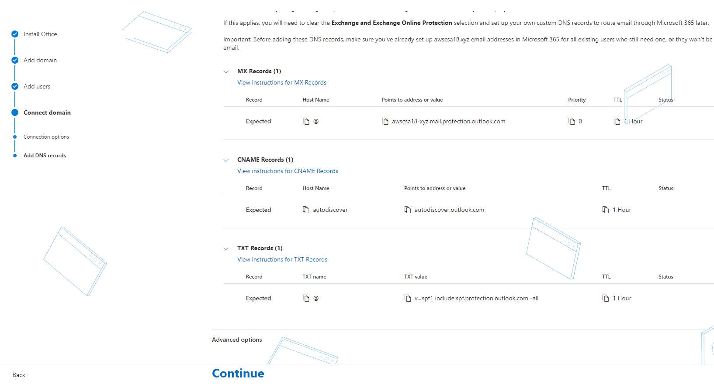
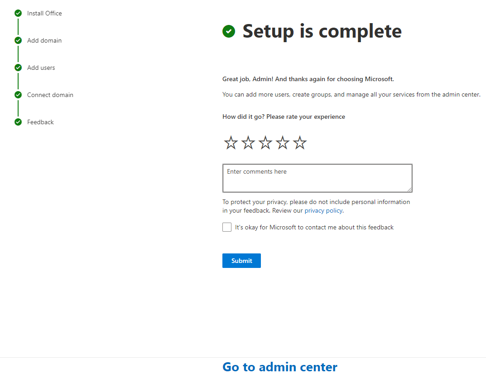

# Office365 Setup

1. Sing up for [Office 365 E3 free 1-month trial](https://signup.microsoft.com/get-started/signup?products=cfq7ttc0k59j:0009&culture=en-us&country=lk&ali=1).

1. In the Email box enter admin@yourdomain.xyz (domain you setup earlier).

    

1. on the next screen click on **Create new account**

    

1. Fill the information on this screen.Click **Next**

   

1. Verify the phone number you entered on the previous screen.

    

    

1. On this screen, setup your Office365 default admin account.

    Username=admin

    Domain name=first part of your domain(for ex. awscsa18 for awscsa18.xyz)

    Password:

    Click **Next**

1. It will take sometime to create the account.Do not refresh the page until you see below screen. 

    Note down your **username**.

    Click on **Get Started**.

    

1. On the next login screen, enter the previous user name and the password to login to Office365 Admin Portal.

    It will take you to a setup wizard.

1. Click **Continue** on the bottom of the page.

     

1. Enter your domain name while the first option (Yes, add this domain now) selected. Then click **Use this domain** on the bottom of the page.

    

1. On this screen click on **More option**.

    

    Select the second option, **Add a TXT record to the domain's DNS records**

    Click **Continue**

    

1. Note the TXT record information metioned on the page.Dont click on **Verify** at this stage.You need to update this on our domain's DNS records.

    

1. Login to your DNS hosting provider account.[Cloudflare](https://dash.cloudflare.com/login/).

    * Select your domain on the Home page.
    * Click **DNS** on the left pannel.

1. On DNS page click on **Add record**.

    

    * **Type** = TXT
    * **Name** = @
    * **TTL** = 1hr
    * **Content** = TXT value from the Office365 setup wizard.

    

    Click on **Save**.

    Now you need to wait sometime for DNS to propergate.
    You can check the DNS propagation update on this website.

    https://www.whatsmydns.net/#TXT/yourdomainname.

    Replace the last url path section with your domain name.

    Ex: https://www.whatsmydns.net/#TXT/awscsa18.xyz

1. When you see it has propagated to many locations, go back to Office365 wizard page. And now click on **Verify**.

    

1. Click on **Do this later** on this page.We can create users later.

    

1. On this page, select the 2nd option.(**Add your own DNS records**) Click **Continue**.

    

1. On this page exapnd the **MX Records** , **CNAME Records**, **TXT Records** sections. We need to create these records in your DNS hosting provider account.[Cloudflare](https://dash.cloudflare.com/login/). 

    

1. Head back to your DNS management console.

    Create three DNS records as mentinoed below.Use the values provided on your Office365 setup wizard page.

    

    
    
    

    Now you need to wait sometime for DNS to propergate.
    You can check the DNS propagation update on this website.

    Replace the last url path section with your domain name.

    https://www.whatsmydns.net/#MX/yourdomain.xyz

    https://www.whatsmydns.net/#TXT/yourdomain.xyz

    https://www.whatsmydns.net/#CNAME/autodiscover.yourdomain.xyz

1. Head back to Office365 setup wizard page and click on **Continue**.
    

    Your setup wizard is completed now.Click on **Go to admin center** to access the Office365 admin center portal.

    

