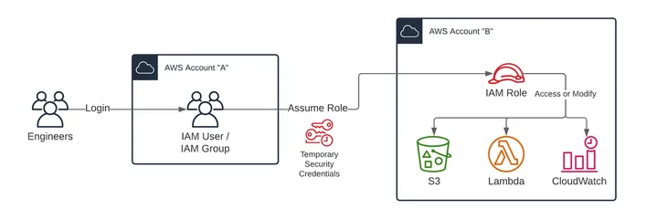

# Overview of access management: Permissions and policies
The access management portion of AWS Identity and Access Management (IAM) helps you define what a principal entity is allowed to do in an account. A principal entity is a person or application that is authenticated using an IAM entity (user or role). Access management is often referred to as authorization. You manage access in AWS by creating policies and attaching them to IAM identities (users, groups of users, or roles) or AWS resources. A policy is an object in AWS that, when associated with an identity or resource, defines their permissions. AWS evaluates these policies when a principal uses an IAM entity (user or role) to make a request. Permissions in the policies determine whether the request is allowed or denied. Most policies are stored in AWS as JSON documents.

### Policies and accounts
If you manage a single account in AWS, then you define the permissions within that account using policies. If you manage permissions across multiple accounts, it is more difficult to manage permissions for your users. You can use IAM roles, resource-based policies, or access control lists (ACLs) for cross-account permissions. However, if you own multiple accounts, its recommend using the AWS Organizations service to help you manage those permissions.

### Policies and users
IAM users are identities in the service. When you create an IAM user, they can't access anything in your account until you give them permission. You give permissions to a user by creating an identity-based policy, which is a policy that is attached to the user or a group to which the user belongs.

The following example shows a JSON policy that allows any attached user to sign in to the AWS Management Console with read-only access to IAM data.

``` json
{
    "Version": "2012-10-17",
    "Statement": [ {
        "Effect": "Allow",
        "Action": [
            "iam:GenerateCredentialReport",
            "iam:Get*",
            "iam:List*"
        ],
        "Resource": "*"
    } ]
}
```
Actions or resources that are not explicitly allowed are denied by default. For example, if the preceding policy is the only policy that is attached to a user, then that user is allowed only to sign in to the AWS Management Console with read-only access to IAM data. Actions on all other IAM funtions (create/modify users or groups etc) are prohibited. Similarly, the user is not allowed to perform any actions in Amazon EC2, Amazon S3, or in any other AWS service. The reason is that permissions to work with those services are not included in the policy.

### Policies and groups
You can organize IAM users into IAM groups and attach a policy to a group. In that case, individual users still have their own credentials, but all the users in a group have the permissions that are attached to the group. Use groups for easier permissions management.


Users or groups can have multiple policies attached to them that grant different permissions. In that case, the permissions for the users are calculated based on the combination of policies. But the basic principle still applies: If the user has not been granted an explicit permission for an action and a resource, the user does not have those permissions.

### Federated users and roles

Federated users don't have permanent identities in your AWS account the way that IAM users do. To assign permissions to federated users, you can create an entity referred to as a role and define permissions for the role. When a federated user signs in to AWS, the user is associated with the role and is granted the permissions that are defined in the role.


)

### Identity-based and resource-based policies

Identity-based policies are permissions policies that you attach to an IAM identity, such as an IAM user, group, or role. Resource-based policies are permissions policies that you attach to a resource such as an Amazon S3 bucket or an IAM role trust policy.

**Identity-based policies** control what actions the identity can perform, on which resources, and under what conditions. Identity-based policies can be further categorized:

* Managed policies – Standalone identity-based policies that you can attach to multiple users, groups, and roles in your AWS account. You can use two types of managed policies:

    * AWS managed policies – Managed policies that are created and managed by AWS. If you are new to using policies, its recommend that you start by using AWS managed policies.

    * Customer managed policies – Managed policies that you create and manage in your AWS account. Customer managed policies provide more precise control over your policies than AWS managed policies. You can create, edit, and validate an IAM policy in the visual editor or by creating the JSON policy document directly.

* Inline policies – Policies that you create and manage and that are embedded directly into a single user, group, or role. In most cases, we don't recommend using inline policies.

**Resource-based policies** control what actions a specified principal can perform on that resource and under what conditions. Resource-based policies are inline policies, and there are no managed resource-based policies. To enable cross-account access, you can specify an entire account or IAM entities in another account as the principal in a resource-based policy.

The IAM service supports only one type of resource-based policy called a role trust policy, which is attached to an IAM role. Because an IAM role is both an identity and a resource that supports resource-based policies, you must attach both a trust policy and an identity-based policy to an IAM role. Trust policies define which principal entities (accounts, users, roles, and federated users) can assume the role.