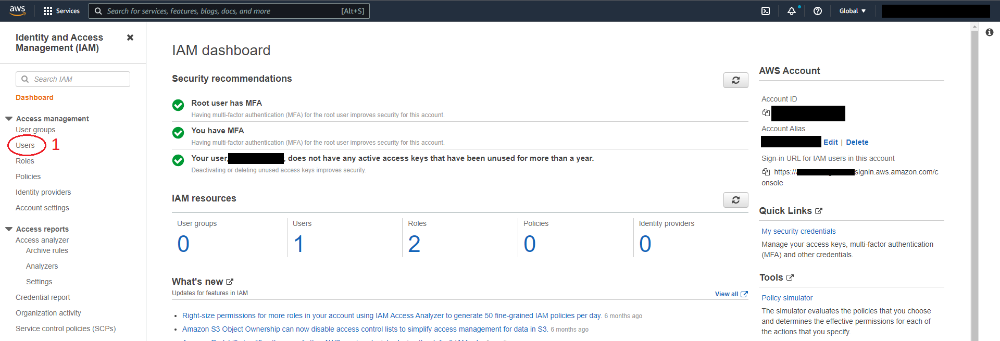

# IAM Policy Document

```json
{
   "Version":"2012-10-17",
   "Statement":[
      {
         "Sid":"statement1", <--- Sid=Statement ID (optional)
         "Effect":"Allow",   <--- Effect=Allow/Deny 
         "Action":[          <--- Action=Resource actions 
            "s3:*"
         ],
         "Resource":[        <--- Resource=Object that exists within a service (Ec2,IAM,S3..)
            "arn:aws:s3:::*"
         ]
       },
       {
         "Effect": "Deny",
         "Action": "s3:*",
         "Resource": [
           "arn:aws:s3:::<bucketname>", "arn:aws:s3:::<bucketname>/*"
         ]
       }
    ]
}
```
* A policy consists of one or more statements.

* A statement is a combination of two main things, the resource and the action.

* Action can be an individual action, a list of actions or wildcard(every action).

* In resoruces also it be a specific single resource, a lsit of resources or wildcard(every resource). For an individual resource or a lsit of resources you have to use [**AWS ARN**](https://github.com/expertfocus-devops/aws-sa-associate-saac02/blob/pre-prod/AWS%20Identity%20and%20Access%20Management/Amazon%20Resource%20Names.md) of the resource.

* Effect controlls what AWS does if the action and resoruce part of the statement match to what action you are attempting to perform. 

* Explicit DENY always take priority over Explicit ALLOW. If no Explicit ALLOW or Explicit DENY defined Default DENY (Implicit) apply.

    DENY --> ALLOW --> DENY

### Practical Session - 01
1. Create two IAM users:
    * David
    * Jessica
1. Create two IAM Groups:
    * Finance
    * HR
1. Create three S3 buckets:
    * xxxx-financebucket
    * xxxx-hrbucket
    * xxxx-temp-bucket
1. Create two IAM customer managed plociy documents:
   * cm-finance-bucket-policy - allow access only to Finance bucket
   * cm-hr-bucket-policy - allow access only to HR bucket
1. Login to one account and check access to S3 buckets.
1. Attached policies:
    * Attach S3 Full Access AWS Managed policy to both users.And check access by login to console/cli.Then remove this policy from both users.
    * Attach finance-bucket-policy to David and hr-bucket-policy to Jessica.Check access.
        * Attache hr-bucket-policy also to David and check.
        * Then remove policies from both users.
    * Then attach the respective policy with Finance and HR groups.Add David to Finance group and Jessica to HR group.Check S3 access for both users.
        * Attach cm-hr-bucket-policy also to Finance group.Then S3 access for David.
1. Create an Inline policy for David.(access to xxxx-tem-bucket)

### Guidelines

1. Login to your AWS account (General) as the iamadminuser.
1. Navigate to IAM section on the [console](https://us-east-1.console.aws.amazon.com/iamv2/home?region=us-east-1#/home).
1.Click on "Users" in the left hand side menu.



[](https://www.youtube.com/watch?v=wRzzBb18qUw&ab_channel=AmazonWebServices)