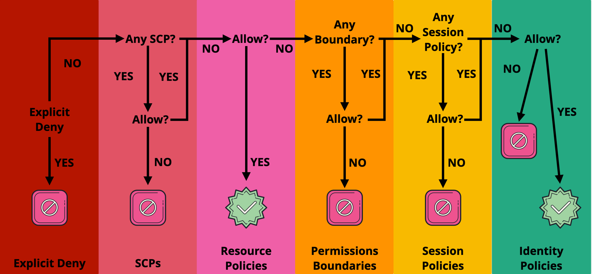
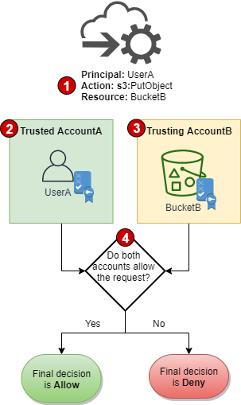

# What is IAM  <Image src="images/iam.png" alt="img" width="50"/>

AWS Identity and Access Management (IAM) is a web service that helps you securely control access to AWS resources.

**IAM control** who is **authenticated** (signed in) and **authorized** (has permissions) to use resources.

When you first create an AWS account, you begin with a single sign-in identity that has complete access to all AWS services and resources in the account. This identity is called the AWS account **root user** and is accessed by signing in with the email address and password that you used to create the account.

### Lock away your AWS account root user access keys

You use an **access key** (an access key ID and secret access key) to make **programmatic requests to AWS**.

However, do not use your AWS account root user access key. The access key for your AWS account root user gives full access to all your resources for all AWS services, including your billing information. **You cannot reduce the permissions associated with your AWS account root user access key.**

Therefore, protect your root user access key like  any other sensitive secret.

Here are some ways to do that:

* Its strongly recommend that you **do not use the root user for your everyday tasks**, even the administrative ones. Instead, use your root user credentials only to create your IAM admin user. Then securely lock away the root user credentials and use them to perform only a few account and service management tasks. **For everyday tasks, do not use your IAM admin user. Instead, use roles to delegate permissions**.
* If you do have an access key for your AWS account root user, delete it. If you must keep it, rotate (change) the access key regularly. To delete or rotate your root user access keys, go to the [My Security Credentials](https://console.aws.amazon.com/iam/home?#security_credential) page in the AWS Management Console and sign in with your account's email address and password. You can manage your access keys in the Access keys section.
* Use a strong password to help protect account-level access to the AWS Management Console.
* Enable AWS multi-factor authentication **(MFA)** on your AWS account root user account.

## Understanding how IAM works

Before you create users, you should understand how IAM works. IAM provides the infrastructure necessary to control authentication and authorization for your account. The IAM infrastructure includes the following elements:

* Terms
* Principal
* Request
* Authentication
* Authorization
* Actions or operations
* Resources

### Terms

**IAM Resources**
The user, group, role, policy, and identity provider objects that are stored in IAM. As with other AWS services, you can add, edit, and remove resources from IAM.

**IAM Identities**
The IAM resource objects that are used to identify and group. You can attach a policy to an IAM identity. These include users, groups, and roles.

**IAM Entities**
The IAM resource objects that AWS uses for authentication. These include IAM users and roles.

**Principals**
A person or application that uses the AWS account root user, an IAM user, or an IAM role to sign in and make requests to AWS. Principals include federated users and assumed roles.

### Principal
A principal is a person or application that can make a request for an action or operation on an AWS resource. The principal is authenticated as the AWS account root user or an IAM entity to make requests to AWS.You can also support federated users or programmatic access to allow an application to access your AWS account.

### Request

When a principal tries to use the **AWS Management Console**, the **AWS API**, or the **AWS CLI**, that principal sends a request to AWS. The request includes the following information:

**Actions or operations** – The actions or operations that the principal wants to perform. This can be an action in the AWS Management Console, or an operation in the AWS CLI or AWS API.

**Resources** – The AWS resource object upon which the actions or operations are performed.

**Principal** – The person or application that used an entity (user or role) to send the request. Information about the principal includes the policies that are associated with the entity that the principal used to sign in.

**Environment data** – Information about the IP address, user agent, SSL enabled status, or the time of day.

**Resource data** – Data related to the resource that is being requested. This can include information such as a DynamoDB table name or a tag on an Amazon EC2 instance.

AWS gathers the request information into a *request context*, which is used to evaluate and authorize the request.

### Authentication
A principal must be authenticated (signed in to AWS) using their credentials to send a request to AWS. Some services, such as Amazon S3 and AWS STS, allow a few requests from anonymous users. However, they are the exception to the rule.

To authenticate from the console as a **root user**, you must sign in with your email address and password*. As an **IAM user**, provide your account ID or alias, and then your user name and password*. To authenticate from the **API or AWS CLI**, you must provide your access key and secret key*. You might also be required to provide additional security information. For example, AWS recommends that you use multi-factor authentication (MFA) to increase the security of your account.

### Authorization
You must also be authorized (allowed) to complete your request. During authorization, AWS uses values from the request context to check for policies that apply to the request. It then uses the policies to determine whether to allow or deny the request. 

There are several types of policies that can affect whether a request is authorized. To provide your users with **permissions to access the AWS resources in their own account**, you need only **identity-based policies**. **Resource-based policies** are popular for granting **cross-account access**.

#### Policy types
The following policy types, listed in order from most frequently used to less frequently used, are available for use in AWS. For more details, see the sections below for each policy type.

**Identity-based policies** – Attach managed and inline policies to IAM identities (users, groups to which users belong, or roles). Identity-based policies grant permissions to an identity.

**Resource-based policies** – Attach inline policies to resources. The most common examples of resource-based policies are Amazon S3 bucket policies and IAM role trust policies. Resource-based policies grant permissions to the principal that is specified in the policy. Principals can be in the same account as the resource or in other accounts.

**Permissions boundaries** – Use a managed policy as the permissions boundary for an IAM entity (user or role). That policy defines the maximum permissions that the identity-based policies can grant to an entity, but does not grant permissions. Permissions boundaries do not define the maximum permissions that a resource-based policy can grant to an entity.

**Organizations SCPs** – Use an AWS Organizations service control policy (SCP) to define the maximum permissions for account members of an organization or organizational unit (OU). SCPs limit permissions that identity-based policies or resource-based policies grant to entities (users or roles) within the account, but do not grant permissions.

**Access control lists (ACLs)** – Use ACLs to control which principals in other accounts can access the resource to which the ACL is attached. ACLs are similar to resource-based policies, although they are the only policy type that does not use the JSON policy document structure. ACLs are cross-account permissions policies that grant permissions to the specified principal. ACLs cannot grant permissions to entities within the same account.

**Session policies** – Pass advanced session policies when you use the AWS CLI or AWS API to assume a role or a federated user. Session policies limit the permissions that the role or user's identity-based policies grant to the session. Session policies limit permissions for a created session, but do not grant permissions. For more information, see Session Policies.

#### Policy Evaluation Logic - Same Account

#### Policy Evaluation Logic - Cross Account

1.When a principal in one account makes a request to access a resource in another account, this is a cross-account request.

1.The requesting principal exists in the trusted account (AccountA). When AWS evaluates this account, it checks the identity-based policy and any policies that can limit an identity-based policy. 

1.The requested resource exists in the trusting account (AccountB). When AWS evaluates this account, it checks the resource-based policy that is attached to the requested resource and any policies that can limit a resource-based policy.

1.AWS allows the request only if both account policy evaluations allow the request.